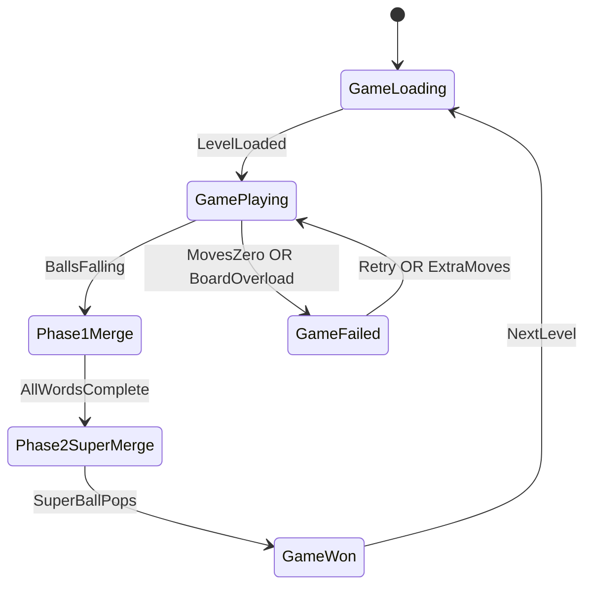
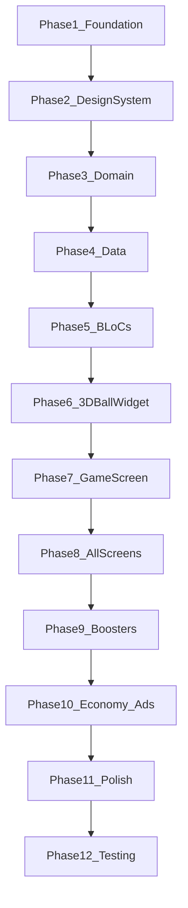

# BubbleWord — Comprehensive Implementation Plan

## Current State

| Asset | Status |
|-------|--------|
| Flutter project | Fresh scaffold — only [`lib/main.dart`](lib/main.dart) Hello World |
| [`levels.json`](levels.json) | 1000 levels, schema matches PDF Section 12; **no `move_budget` field** (must compute at runtime) |
| UI assets / sounds / Lottie | **None** — all visuals built in Flutter from GDD color/dimension specs |
| Architecture / BLoC / theme | **Not started** |

## Game vs Reference App ([Bouncy Match: Bubble Word](https://play.google.com/store/apps/details?id=wordsort.merge.bubble))

Shared DNA (reference app): drag-to-merge bubbles, category hints, move-limited levels, booster bar, level map, lives/coins economy, rewarded ads on fail.

**BubbleWord differences (PDF is authoritative):**
- Each bubble holds **1–3 letter fragments**, not whole words
- **Two-phase win**: Phase 1 form all words → Phase 2 merge word-balls into super-ball → pop
- Wrong merges create **junk balls** (grey + shake); recoverable via Magic Wand
- South Asian categories (Pakistani cities, cricketers, etc.)



---

## Phase 1 — Project Foundation

### 1.1 Dependencies ([`pubspec.yaml`](pubspec.yaml))

Add per PDF Section 15 (Step 1 + packages table):

- **State / routing / DI**: `flutter_bloc`, `bloc`, `equatable`, `go_router`, `get_it`, `injectable`, `injectable_generator` (dev)
- **Persistence**: `shared_preferences`
- **Media**: `audioplayers`, `lottie`
- **Monetization (test mode)**: `google_mobile_ads` with **Google test ad unit IDs**
- **Optional physics**: skip `flame` initially — use custom Flutter physics for lighter control and smoother merge animations; revisit only if falling-ball simulation is insufficient

### 1.2 Asset wiring

- Move [`levels.json`](levels.json) → `assets/data/levels.json`
- Declare in `pubspec.yaml`: `assets/data/`, `assets/audio/`, `assets/lottie/`
- Add placeholder audio (merge, wrong, win, fail, pop) and Lottie confetti JSON (free assets or minimal generated placeholders)

### 1.3 Clean Architecture folder structure (PDF Section 10.1)

```
lib/
├── core/          constants, theme, utils, widgets, router, di
├── data/          datasources, models, repositories
├── domain/        entities, repositories (abstract), usecases
└── presentation/  bloc, screens, widgets
```

### 1.4 Dependency injection

- `get_it` + `injectable`: register datasources, repos, use cases, all BLoCs
- Entry point: [`lib/main.dart`](lib/main.dart) → `App` with `MultiBlocProvider`, `MaterialApp.router`, `AppTheme`

---

## Phase 2 — Central Design System (PDF Sections 11, 14)

**Zero hardcoded colors/sizes in widgets** — all from theme files.

| File | Contents |
|------|----------|
| [`lib/core/constants/app_colors.dart`](lib/core/constants/app_colors.dart) | `#0F1923` darkBg, `#00B4D8` accentBlue, `#FFD166` accentGold, `#EF476F` accentRed, etc. + `ballColors` map per category (Colors, Fruits, Animals, Countries, Sports, Flowers, Planets, Default) |
| [`lib/core/constants/app_dimensions.dart`](lib/core/constants/app_dimensions.dart) | ball radii (22/28/40/80 dp), bar heights, padding, animation durations, `scale(context)` helper |
| [`lib/core/constants/app_strings.dart`](lib/core/constants/app_strings.dart) | All user-facing strings |
| [`lib/core/theme/app_text_styles.dart`](lib/core/theme/app_text_styles.dart) | Responsive, textScaleFactor-aware styles |
| [`lib/core/theme/app_decorations.dart`](lib/core/theme/app_decorations.dart) | Card borders, gradients, glow effects |
| [`lib/core/theme/app_theme.dart`](lib/core/theme/app_theme.dart) | MaterialApp dark theme |

**Responsive contract (PDF 11.3):**
- `LayoutBuilder` / `MediaQuery` everywhere
- Tablet breakpoint: 600dp width
- Ball sizes scale 22dp (small phone) → 32dp (tablet) via `AppDimensions.scale(context)`

---

## Phase 3 — Domain Layer (PDF Sections 10.3, 4, 5, 6)

### 3.1 Entities (pure Dart — no Flutter imports)

```dart
// domain/entities/
Ball, Word, Level, GameState, EconomyState, BoosterInventory, PlayerProgress
```

`BallType`: `fragment | wordInProgress | completeWord | superBall | junk | hintGhost`

`GamePhase`: `buildingWords | mergingWords | won | failed`

### 3.2 Repository interface

- [`lib/domain/repositories/level_repository.dart`](lib/domain/repositories/level_repository.dart): `getLevel(id)`, `getTotalLevels()`, `getNextLevel(id)`

### 3.3 Use cases (PDF Section 10 + game rules)

| Use case | Logic |
|----------|-------|
| `GetLevel` | Load level by ID |
| `GetNextLevel` | ID + 1 capped at 1000 |
| `CalculateMoveBudget` | **Runtime compute** (levels.json lacks field): `minMoves = Σ(ball_count - 1 per word) + (word_count - 1 for super-merge)` × difficulty multiplier (easy 2.5, medium 2.0, hard 1.7, expert 1.5, master 1.3) |
| `ValidateMerge` | Same word + valid fragment combo → wordInProgress/completeWord; different words → junk ball |
| `MergeBalls` | Apply merge, decrement moves, update board |
| `CheckBoardOverload` | Board full + no valid merge → auto-fail |
| `CalculateStarRating` | 3★ = 30%+ moves left, 2★ = 10–30%, 1★ = <10% |
| `SplitJunkBall` | Magic Wand — restore original fragments |
| `SpawnBallFromQueue` | Add Ball booster — release next queued fragment |

---

## Phase 4 — Data Layer (PDF Section 12)

### 4.1 Models + JSON parsing

- `WordModel`, `LevelModel`, `LevelsFileModel` with `fromJson`/`toJson`
- Map models → domain entities in repository

### 4.2 LocalLevelDataSource

- `rootBundle.loadString('assets/data/levels.json')`
- Parse once at startup, cache in memory (1000 levels ≈ 60K lines — acceptable)
- Optional: validate schema with `LevelValidator` util

### 4.3 LevelRepositoryImpl

- Implements `LevelRepository`
- Attaches computed `moveBudget` via `CalculateMoveBudget` on each `getLevel` call

### 4.4 PlayerProgressDataSource (SharedPreferences)

Persist: current level, per-level stars, coins, lives (max 5), booster counts, settings (sound/music/haptics), daily streak, last daily date, levels-completed count (for interstitial cadence), no-ads flag

---

## Phase 5 — BLoC State Machines (PDF Section 10.2)

| BLoC | Key events | Key states |
|------|-----------|------------|
| **LevelBloc** | `LoadLevel`, `LoadNextLevel`, `RestartLevel` | `LevelLoading`, `LevelLoaded`, `LevelError` |
| **GameBloc** | `StartLevel`, `BallDropped`, `DragBall`, `MergeBalls`, `SuperMerge`, `TickPhysics`, `CheckWinFail`, `UndoWrongMerge` | `GameInitial`, `GamePlaying(phase, board, queue, movesLeft, wordTray)`, `GameWon`, `GameFailed(reason)` |
| **EconomyBloc** | `EarnCoins`, `SpendCoins`, `AddLife`, `SpendLife`, `RefillLifeTimer` | coins, lives, refill countdown |
| **BoosterBloc** | `UseHint`, `UseMagnet`, `UseAddBall`, `UseMagicWand`, `UseExtraMoves` | inventory counts, active booster state |
| **AdBloc** | `ShowRewardedAd`, `ShowInterstitial`, `AdCompleted` | test ad flow; **never mid-level** |
| **SettingsBloc** | `ToggleSound`, `ToggleMusic`, `ToggleHaptics` | persisted prefs |

**GameBloc core state machine details:**

1. **Level start**: flatten all word fragments into a **drop queue**; spawn balls in waves from top
2. **Phase 1**: player drags fragment onto fragment/word-in-progress; each merge costs 1 move
3. **Complete word**: ball glows, animates to **word tray** (bottom), shows `X/N` progress
4. **Phase 2 trigger**: all words complete → show **"MERGE NOW!"** pulse; word-ball merges only
5. **Win**: final super-ball → pop animation → emit `GameWon` with stars/coins
6. **Fail**: moves = 0 OR board overload → `GameFailed`

---

## Phase 6 — 3D Bubble Ball Widget (User requirement + PDF Section 3)

[`lib/core/widgets/bubble_ball_widget.dart`](lib/core/widgets/bubble_ball_widget.dart) — the most critical visual component.

**3D sphere effect (CustomPainter + layered widgets):**
- Radial gradient: highlight top-left (white 40% opacity) → mid tone → shadow bottom-right
- Inner glow ring + outer soft `BoxShadow` (depth)
- Specular highlight dot (small white circle, offset top-left)
- Category gradient from `AppColors.ballColors[category]`
- Subtle idle **float animation** (`AnimationController`, sine Y-offset ±3dp)
- States:
  - **Fragment**: small radius, letter chars centered
  - **Word-in-progress**: pulsing scale + progress ring `X/N`
  - **Complete word**: glow border + category accent particle on complete
  - **Super ball**: 80dp radius, rainbow gradient, slow rotation
  - **Junk**: grey desaturate + shake animation
  - **Hint ghost**: dashed border, semi-transparent

**Smooth animations (60fps target):**
- Drag: ball follows finger with slight lag (spring simulation via `AnimatedPositioned` or manual lerp in `Ticker`)
- Merge snap: `Curves.elasticOut` scale 1.0→1.3→1.0 over 300ms
- Wrong merge: horizontal shake 3 cycles + red flash overlay 200ms
- Super-ball pop: scale up → particle burst (Lottie or `CustomPainter` confetti) → fade

---

## Phase 7 — Game Screen (PDF Screens 03–04, Section 2)

[`lib/presentation/screens/game_screen.dart`](lib/presentation/screens/game_screen.dart)

**Layout (top → bottom):**
1. **Top bar**: back, coins, hearts
2. **Hint bar** (48dp): `"Find 3 colors"` in accentCyan
3. **Move counter** (large, accentGold) — most prominent element
4. **Playfield** (expanded): falling/draggable balls with physics
5. **Word tray** (64dp): completed word-balls + empty slots
6. **Booster bar** (56dp): Hint / Magnet / Add Ball / Magic Wand + queue counter

**Physics (custom, no Flame initially):**
- Balls spawn at random X along top, fall with gravity + slight horizontal drift
- Soft collision: balls stack/rest without overlapping (circle-circle resolution)
- Drag overrides physics while finger is down
- Drop zone detection: merge if dragged ball overlaps target ball within threshold

**Gesture handling:**
- `GestureDetector` / `Listener` on each ball
- Drag trail: semi-transparent gradient behind active ball
- Haptic feedback on merge (if enabled in SettingsBloc)

**Reference app alignment:** board feels crowded over time, boosters along bottom, hint at top — match [Bouncy Match](https://play.google.com/store/apps/details?id=wordsort.merge.bubble) layout rhythm while using BubbleWord's letter-fragment mechanic.

---

## Phase 8 — All Screens (PDF Section 14)

| Screen | File | Key elements |
|--------|------|--------------|
| **01 Splash** | `splash_screen.dart` | 4 colored balls logo animation, tagline "Merge letters. Find words.", loading bar, auto-navigate 2.5s |
| **02 Home / Level Map** | `home_screen.dart` | Winding level path, star badges, pulsing PLAY CTA, coins+hearts top bar, bottom nav (Map/Shop/Daily/Settings) |
| **03 Gameplay** | `game_screen.dart` | (Phase 7) |
| **04 Merge in Progress** | overlays in game_screen | Progress ring, word tray fill, drag trail |
| **05 Level Complete** | `level_complete_overlay.dart` | Super-ball burst, 3-star rating, coins earned, word list, glowing NEXT LEVEL |
| **06 Level Fail** | `level_fail_overlay.dart` | Red X (non-aggressive), Watch Ad FREE (highlighted), Use coins, Try Again (-1 heart), hearts + refill timer |
| **07 Shop** | `shop_screen.dart` | Coin bundles (500/2000/5000), booster packs, Remove Ads banner, daily free reward — **stub IAP** initially |
| **08 Daily Challenge** | `daily_challenge_screen.dart` | Flame icon, category hint, streak counter, countdown, golden heart life system |

**Navigation:** `go_router` routes: `/`, `/home`, `/game/:levelId`, `/shop`, `/daily`, `/settings`

---

## Phase 9 — Booster System (PDF Section 8)

| Booster | Implementation |
|---------|----------------|
| **Hint** | Highlight 2 fragments of same incomplete word + dotted line connector; 3 free + daily earn |
| **Magnet** | Word picker dialog → auto-merge all fragments for chosen word with full animation |
| **Add Ball** | Pop next queued fragment onto board; 1 free ad/level |
| **Magic Wand** | Split last junk/wrong merge back to fragments |
| **Extra Moves** | +5 moves; rewarded ad (1×/level free) or 100 coins |

Booster inventory tracked in `EconomyBloc` / `BoosterBloc`, persisted via SharedPreferences.

---

## Phase 10 — Economy, Lives & Monetization (PDF Sections 9, 13)

**Economy rules:**
- Start: 5 lives, refill 1 per 30 min
- Level complete: coin rewards by star rating (50/25/10)
- Spend life on fail retry

**Ads (test units first — user confirmed):**
- **Interstitial**: after every **3 completed levels** only — never mid-level
- **Rewarded**: opt-in on fail (+5 moves OR +1 Add Ball) and optional shop rewards
- `AdBloc` wraps `google_mobile_ads`; guard with `noAdsPurchased` flag

**IAP (stub phase):**
- Define product IDs in constants; UI wired but purchases return mock success until Play/App Store Connect setup
- Products: coin tiers, life refill (50 coins), Remove Ads, booster bundle

---

## Phase 11 — Audio, Haptics & Polish

- `audioplayers`: merge snap, wrong merge buzz, word complete chime, super-ball pop, win fanfare, fail tone
- Respect `SettingsBloc` mute flags
- Lottie confetti on win overlay
- Category-specific particle bursts on word complete (sparkle, leaf, paw, etc. per PDF Section 3 color table)

---

## Phase 12 — Testing & QA

**Unit tests:**
- `CalculateMoveBudget` — verify Level 1 = 8 min moves × 2.5 = 20 budget
- `ValidateMerge` — correct/incorrect/junk scenarios
- `CalculateStarRating` thresholds
- `LevelModel.fromJson` parsing

**Widget tests:**
- `BubbleBallWidget` renders all BallTypes
- Game overlays show correct options on fail

**Manual QA checklist:**
- Full Level 1 playthrough (RED/BLUE/GREEN → super-ball)
- Wrong merge → junk → Magic Wand undo
- Moves = 0 fail flow with rewarded ad
- Board overload fail
- Level map progression + star persistence
- Tablet layout at 600dp+
- No interstitial during active gameplay

---

## Implementation Order (matches PDF Section 15, expanded)



**Recommended first playable milestone:** Phases 1–7 → Level 1 fully playable with merge, two-phase win, move counter, and 3D balls. Then layer screens, economy, ads.

---

## Key Gaps / Decisions Documented

| Gap | Resolution |
|-----|------------|
| `move_budget` missing from JSON | Compute at runtime via `CalculateMoveBudget` use case |
| No image assets from PDF | Build UI purely from GDD hex colors + dimension table + screen descriptions |
| Flame vs custom physics | Custom Flutter physics first; smoother merge control, lighter app size |
| Monetization credentials | Test AdMob units + stub IAP (user choice) |
| Daily challenge level selection | Deterministic: `dayOfYear % 1000 + 1` from levels pool, separate golden-heart life pool |

---

## Files to Create (high priority first batch)

1. `pubspec.yaml` — deps + assets
2. `assets/data/levels.json` — move from root
3. `lib/core/constants/*` — colors, dimensions, strings
4. `lib/core/theme/*` — theme system
5. `lib/domain/entities/*` + `usecases/*`
6. `lib/data/models/*` + `datasources/*` + `repositories/*`
7. `lib/presentation/bloc/*` — 6 BLoCs
8. `lib/core/widgets/bubble_ball_widget.dart` — 3D ball
9. `lib/presentation/screens/game_screen.dart` — core gameplay
10. Remaining screens + overlays + router
